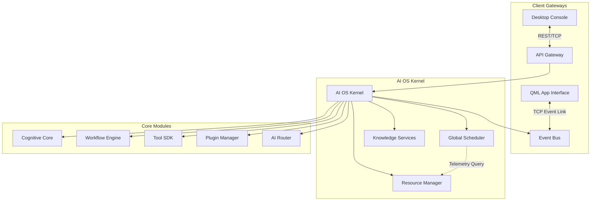

# JARVIS Enterprise AI Operating System Architecture (Phase V)

This document details the architectural layout, core subsystems, communication protocols, and execution loops of the Phase V Enterprise AI Operating System (AI OS) kernel and coordination layers.

---

## 1. System Topology Overview

The AI OS shifts JARVIS from an isolated voice assistant model to an event-driven AI Kernel. All sub-modules, including Cognitive Core, the Workflow Engine, the Tool SDK, and local/remote providers, communicate asynchronously over the Event Bus or are prioritized using the Global Scheduler.

---

## 2. Kernel Lifecycle & Subsystems

### 2.1 AI Operating System Kernel (`ai_kernel.py`)
The orchestrator of the entire operating system stack. Coordinates startup/shutdown workflows:
- **TCP IPC Bridging:** Dynamically starts TCP server socket interfaces to handle legacy cross-process event listeners.
- **Security Boundaries:** Enforces Role-Based Access Control (RBAC) and utilizes symmetric `cryptography` encryption suites to safeguard cached enterprise API credentials.
- **AI Resource Optimizer:** Dynamically analyzes network activity, hardware load metrics, task priorities, and prompt lengths to determine whether to route requests locally (e.g. Ollama) or offload to clouds (Gemini, Claude, Groq, ChatGPT, DeepSeek) for optimal cost, latency, and context sizes.

### 2.2 Global Scheduler (`scheduler.py`)
Maintains a thread-safe `PriorityQueue` sorting all scheduled tasks (AI requests, tools, workflows, background maintenance tasks, timers).
- **Priority Scaling:** Tasks are prioritized (`HIGH = 1`, `MEDIUM = 2`, `LOW = 3`).
- **Load Balancing:** Automatically cooperates with the `ResourceManager` to defer execution of lower-priority background tasks when resource consumption is high.
- **Execution Safeguards:** Automatically tracks and executes tasks on daemon threads, enforcing safety limits and throwing timeout failures if tasks block.

### 2.3 Resource Manager (`resource_manager.py`)
Continuously monitors system health logs.
- Uses `psutil` to query CPU, RAM, Disk, active threads, and Network I/O metrics.
- Parses `nvidia-smi` to monitor GPU performance, falling back gracefully to simulated metrics if hardware lacks local GPU drivers.
- Automatically broadcasts `SystemAlert` warn tags across the Event Bus if resource metrics exceed safe boundaries (e.g., CPU > 90%).
- Exposes `is_system_idle()` thresholds to allow background loops to trigger.

### 2.4 Event Bus (`event_bus.py`)
The central event routing bus that decouples modules.
- Replaces direct function couplings with asynchronous publisher-subscriber patterns.
- Keeps structured histories of system updates: `VoiceRecognized`, `WorkflowStarted`, `ToolCompleted`, `PluginLoaded`, `ModelSwitched`, `MemoryUpdated`, `SystemAlert`.
- Integrates local callback registers and socket client loops to bridge events into visual GUI threads.

### 2.5 Knowledge Services (`knowledge_services.py`)
Semantic search indexer and Vector Space Model.
- Utilizes `numpy` to calculate document cosine similarities and TF-IDF mappings.
- Ingests whole document folders, splits them into chunk arrays, and generates search embeddings.
- Combines semantic text retrieval with existing `KnowledgeGraph` queries to output ranked, context-enriched RAG prompts.

### 2.6 API Gateway (`api_gateway.py`)
Built-in HTTP server listening on port `18000`. Exposes REST API endpoints and TCP socket event streaming on port `18001`.
- Exposes pathways:
  - `GET /api/v1/health` - Bypasses auth to return instant service state.
  - `GET /api/v1/status` - Live telemetry and queue size statistics.
  - `GET /api/v1/scheduler` - Status of scheduled tasks.
  - `POST /api/v1/command` - Accepts and schedules text/voice queries.
  - `POST /api/v1/event` - Broadcasts user-defined events.
- Enforces Bearer Authorization credentials verification and IP sliding window rate limiting.
