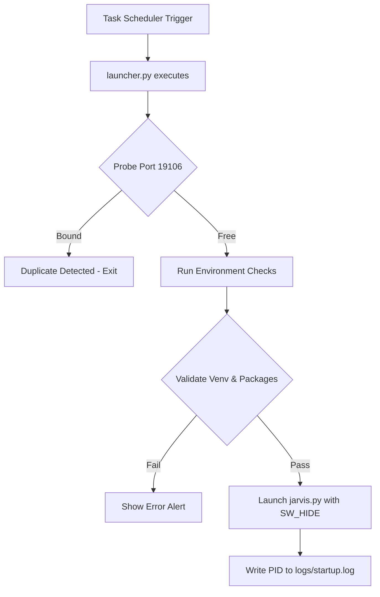

# JARVIS Auto-Start Configuration Guide

This guide documents the Windows Task Scheduler setup, launcher script flow, and runtime environment validation for zero-touch desktop boot.

## 1. Setup Instructions

The automated setup script `scripts/setup_autostart.bat` registers the background launch sequence with Windows Task Scheduler.

### Running Setup:
1. Open a Command Prompt as **Administrator**.
2. Run:
   ```cmd
   cd /d "C:\Path\To\Open.Jarvis-main"
   scripts\setup_autostart.bat
   ```
3. The script will register a task named `JARVIS_AutoStart` in the task scheduler.

---

## 2. Scheduled Task Properties

The registered scheduled task uses the following configuration:
- **Trigger**: "At log on of any user" (configured for current user logon).
- **Execution Account**: Current logged-on user.
- **Privilege Level**: Run with highest privileges (Run as Administrator) to allow diagnostics and system monitoring.
- **Action**: Run the virtual environment Python interpreter with the launcher script:
  ```cmd
  "C:\Path\To\Open.Jarvis-main\.venv\Scripts\python.exe" "C:\Path\To\Open.Jarvis-main\JARVIS\launcher.py"
  ```
- **Settings**:
  - Stop task if it runs longer than: Disabled.
  - Allow task to be run on demand: Enabled.
  - Start only if computer is on AC power: Disabled.

---

## 3. Launcher Script Flow



---

## 4. Troubleshooting and Diagnostics

### Logs
All startup actions, validation checks, and subprocess logs are written to:
`logs/startup.log`

### Common Issues
1. **Tkinter Dialog Error**: If packages are missing, an error alert box is displayed using tkinter. Ensure that `pip install -r requirements.txt` has been run inside `.venv`.
2. **Duplicate Instance Issues**: The launcher checks if port `19106` (used by the GUI) is already bound. If it is, the launcher exits silently, preventing a second duplicate GUI from starting.
