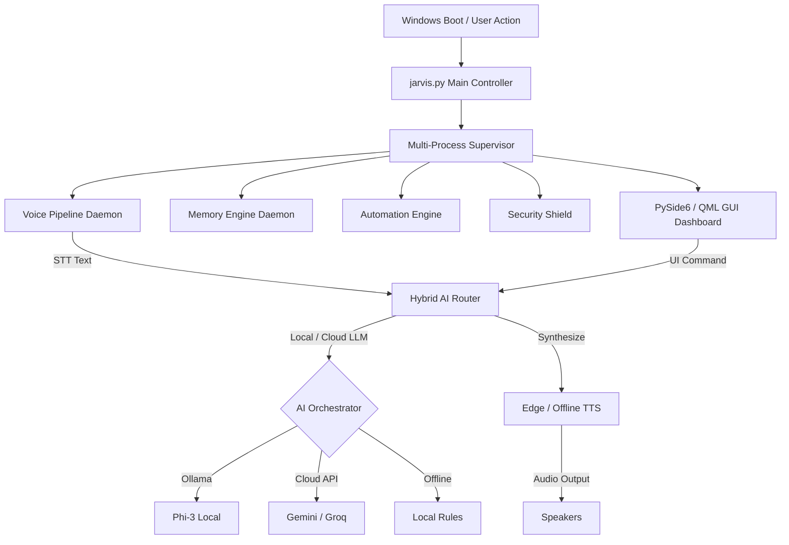

<div align="center">

# 🏛️ HESA (JARVIS) — Enterprise Autonomous AI Desktop Assistant

[](LICENSE)
[](https://www.python.org/)
[](https://www.qt.io/)
[](.github/workflows/ci.yml)
[](CONTRIBUTING.md)

*A privacy-first, zero-latency, multi-modal AI desktop operating system built with PySide6 QML, OpenWakeWord, Faster-Whisper, and adaptive multi-LLM hybrid routing.*

[Key Features](#-key-features) •
[Why HESA?](#-why-hesa) •
[Architecture](#%EF%B8%8F-system-architecture) •
[Quick Start](#-quick-start) •
[Documentation](docs/) •
[Contributing](CONTRIBUTING.md)

</div>

---

## 🌟 Overview

**HESA (JARVIS)** is a world-class autonomous AI desktop assistant designed for Windows 10 and 11. It combines real-time voice recognition, local and cloud multi-LLM routing, holographic QML visualization, multi-layered memory persistence, and system control into a single unified application.

Whether operating entirely offline via local Ollama models or leveraging cloud providers like Gemini and Groq, HESA ensures continuous availability, zero-latency wake word response, and complete privacy control.

---

## 💡 Why HESA?

- 🔒 **Privacy First**: Choose local-only mode (`JARVIS_PRIVACY_MODE=true`) to keep all voice transcription, LLM inference, and memory indexes entirely on your local machine.
- ⚡ **Adaptive AI Mesh**: Automatic failover between local Ollama (Phi-3), Google Gemini, Groq, and offline deterministic rules.
- 🎙️ **Zero-Latency Voice Core**: Powered by custom ONNX OpenWakeWord, Silero Voice Activity Detection (VAD), and Faster-Whisper offline STT.
- 📊 **Holographic QML Dashboard**: A cyber-aesthetic PySide6 QML interface featuring live telemetry, active AI model monitoring, security shield status, and system tray minimization.
- 🧠 **Multi-Tier Memory**: SQLite long-term storage, JSON working memory, and Knowledge Graph semantic search index.

---

## 🏛️ System Architecture



---

## ⚡ Technology Stack

| Domain | Technologies |
|---|---|
| **Core Framework** | Python 3.10+, PySide6 (Qt 6), QML, PyInstaller |
| **Voice Engine** | OpenWakeWord (ONNX), Silero VAD, Faster-Whisper, Edge-TTS, PyTTSx3 |
| **AI & Orchestration** | Ollama (Phi-3), Google Gemini API, Groq Cloud, Local Rule Engine |
| **Memory Systems** | SQLite 3, Knowledge Graph index, JSON Working Memory |
| **Security** | Fernet AES-128 Encryption, Process Isolation, Permission Sandbox |
| **Automation** | Windows API, OpenCV, MediaPipe, PyAutoGUI |

---

## 🚀 Quick Start

### Prerequisites
- **OS**: Windows 10 / 11 (64-bit)
- **Python**: 3.10, 3.11, or 3.12
- **RAM**: 8 GB minimum (16 GB recommended for local LLMs)

### Installation

```bash
# 1. Clone the repository
git clone https://github.com/hchowdary476/HESA.git
cd HESA

# 2. Create and activate a virtual environment
python -m venv .venv
.venv\Scripts\activate

# 3. Install core dependencies
pip install -r requirements.txt

# 4. Set up environment configuration
copy .env.example .env

# 5. Run HESA
python jarvis.py
```

---

## 🗣️ Common Voice Commands

- **Wake Phrase**: `"Hey JARVIS"`
- **System Control**: `"Show system health"`, `"Open calculator"`, `"Close browser"`
- **AI Queries**: `"Summarize memory"`, `"What is the system uptime?"`, `"Calculate 15% of 850"`
- **Security**: `"Enable privacy mode"`, `"Check security status"`

---

## 📂 Repository Structure

```
.
├── jarvis.py                  # Main Application Entry Point & PySide6 Controller
├── memory_engine.py           # Multi-layer Memory & Knowledge Graph Index
├── ai_orchestrator.py         # Hybrid LLM Routing Engine
├── listener_service.py        # Background Voice & Wake Word Listener Daemon
├── JARVIS/
│   ├── core/                  # Voice, AI Router, Memory, Automation, Security Cores
│   ├── gui/                   # PySide6 Main Window, QML Bridge & Holographic UI
│   └── services/              # Supervisor Process Daemon & Health Monitors
├── docs/                      # Complete Technical & User Documentation
├── tests/                     # Comprehensive Unit & Integration Test Suites
├── .github/workflows/ci.yml   # GitHub Actions Continuous Integration
├── .env.example               # Environment Variable Configuration Template
└── README.md                  # Project Overview
```

---

## 📚 Documentation

Detailed documentation is available in the [`docs/`](docs/) directory:

- 🛠️ [Installation Guide](docs/INSTALLATION.md)
- 🏛️ [System Architecture](docs/ARCHITECTURE.md)
- 🎙️ [Voice Pipeline](docs/VOICE_PIPELINE.md)
- 🧠 [AI Router](docs/AI_ROUTER.md)
- 💾 [Memory Engine](docs/MEMORY_ENGINE.md)
- 🔌 [Plugin System](docs/PLUGIN_SYSTEM.md)
- 🛡️ [Security Policy](docs/SECURITY.md)
- 🔧 [Troubleshooting](docs/TROUBLESHOOTING.md)
- ❓ [FAQ](docs/FAQ.md)

---

## 🤝 Contributing

Contributions are warmly welcomed! Please read our [Contributing Guide](CONTRIBUTING.md) and [Code of Conduct](CODE_OF_CONDUCT.md) before submitting pull requests.

---

## 📄 License

Distributed under the **MIT License**. See [`LICENSE`](LICENSE) for details.

---

## 🙏 Acknowledgements

- [OpenWakeWord](https://github.com/dscripka/openwakeword) for zero-latency wake word detection.
- [Faster-Whisper](https://github.com/SYSTRAN/faster-whisper) for fast local speech-to-text.
- [Qt / PySide6](https://www.qt.io/) for QML GUI capabilities.
- [Ollama](https://ollama.ai/) for seamless local LLM inference.
