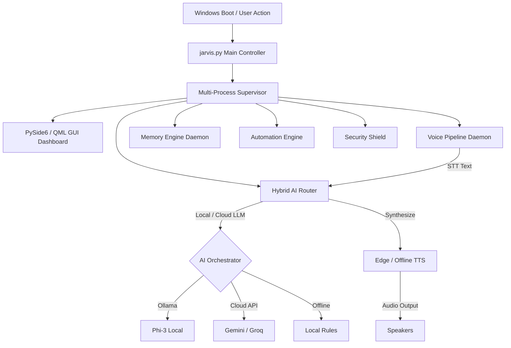

# HESA (JARVIS) — Enterprise Autonomous AI Desktop Assistant

[](LICENSE)
[](https://www.python.org/)
[](https://www.qt.io/)
[](docs/ARCHITECTURE.md)

HESA (JARVIS) is a state-of-the-art, multi-modal, privacy-first desktop AI assistant built with PySide6, QML, OpenWakeWord, Faster-Whisper, and a hybrid multi-LLM AI Orchestrator (Ollama, Gemini, Groq, Claude).

---

## 🌟 Key Features

- 🎙️ **Zero-Latency Voice Pipeline**: Custom ONNX OpenWakeWord engine with Silero VAD, Faster-Whisper offline STT, and Edge TTS / PySide6 TTS playback.
- 🧠 **Hybrid AI Orchestrator**: Automatic LLM failover routing across local Ollama (Phi-3), Google Gemini, Groq, and offline intent classifiers.
- 📊 **Holographic QML Dashboard**: Cyber-aesthetic PySide6 QML interface featuring live system metrics, active AI provider status, security shield controls, and tray integration.
- 💾 **Distributed Memory Engine**: SQLite long-term storage, JSON working memory, and Knowledge Graph semantic search index.
- ⚡ **Autonomous OS Control**: Native application control, browser automation, clipboard management, and system task execution.
- 🛡️ **Cyber Security Shield**: Encrypted key storage, privilege permission manager, and isolated plugin sandbox.

---

## 🏛️ System Architecture



---

## 🖥️ UI Dashboard Preview

*(Placeholders for UI Screenshots)*
- **Main Holographic Dashboard**: `docs/assets/dashboard_preview.png`
- **AI Model Status Page**: `docs/assets/ai_status_preview.png`
- **Security & Permissions**: `docs/assets/security_preview.png`

---

## 📋 System Requirements

- **Operating System**: Windows 10 / 11 (64-bit)
- **Python**: Version 3.10, 3.11, or 3.12
- **RAM**: 8 GB minimum (16 GB recommended for local LLM inference)
- **Audio**: Working Microphone and Output Speakers

---

## 🚀 Quick Start

### 1. Clone the Repository
```bash
git clone https://github.com/your-org/open-jarvis.git
cd open-jarvis
```

### 2. Create and Activate Virtual Environment
```cmd
python -m venv .venv
.venv\Scripts\activate
```

### 3. Install Dependencies
```cmd
pip install -r requirements.txt
```

### 4. Configure Environment Variables
Copy `.env.example` to `.env` and set your API keys:
```cmd
copy .env.example .env
```

### 5. Launch HESA (JARVIS)
```cmd
python jarvis.py
```

---

## 🗣️ Common Voice Commands

- **Wake Word**: `"Hey JARVIS"`
- **System Control**: `"Show system health score"`, `"Open calculator app"`, `"Close Chrome"`
- **AI Queries**: `"Calculate 25 * 40"`, `"Summarize system telemetry"`, `"What is the weather?"`
- **Security**: `"Enable privacy mode"`, `"Check security shield status"`

---

## 📂 Project Structure

```
.
├── jarvis.py                  # Main Application Entry Point & PySide6 Controller
├── memory_engine.py           # Multi-layer Memory & Semantic Knowledge Graph
├── run_jarvis_startup.bat     # Windows Auto-Launch Batch Script
├── create_task.ps1            # Task Scheduler Registration Script
├── JARVIS/
│   ├── core/                  # Voice, AI, Memory, Automation, Vision, Security Cores
│   ├── gui/                   # PySide6 Main Window, JarvisBridge & QML Components
│   └── services/              # Process Supervisor & Background Health Daemons
├── scripts/                   # Production Audits, Stress Tests & Registry Helpers
├── docs/                      # Technical Documentation & Installation Guides
├── requirements.txt           # Core Production Dependencies
└── README.md                  # Release Documentation
```

---

## 🤝 Contributing

We welcome community contributions! Please read our [CONTRIBUTING.md](CONTRIBUTING.md) guide and [CODE_OF_CONDUCT.md](CODE_OF_CONDUCT.md) before submitting pull requests.

---

## 📄 License

Distributed under the MIT License. See [LICENSE](LICENSE) for details.

---

## 🗺️ Roadmap

- [x] PySide6 QML Holographic Interface
- [x] Zero-touch Windows Auto-launch pipeline
- [x] Multi-provider AI router with Ollama Phi-3 local fallback
- [ ] Cross-platform Linux / macOS desktop support
- [ ] Mobile companion app integration
