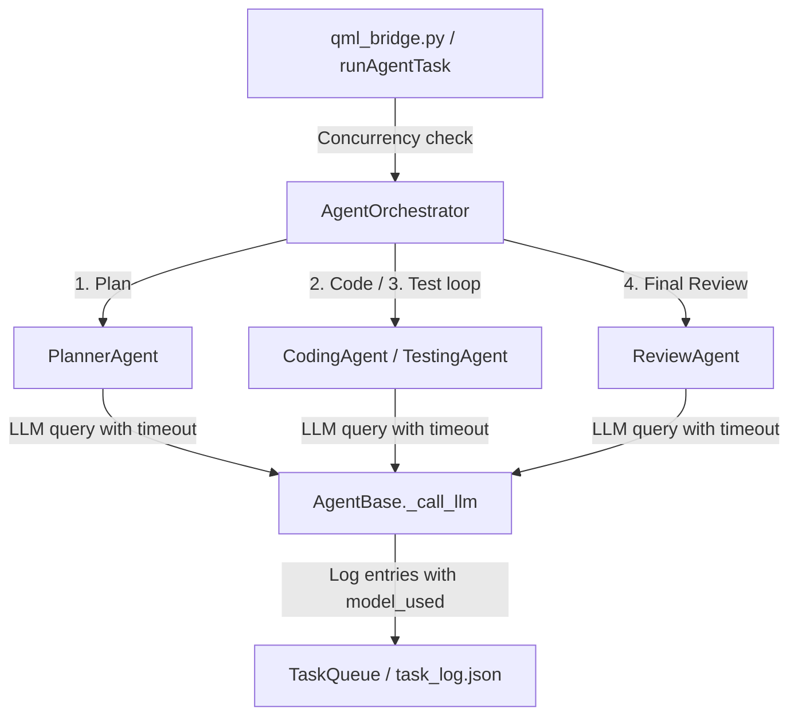

# Phase 1 Multi-Agent Core & Fixes Report

This report outlines the implementation details of the JARVIS Multi-Agent Core, the verification of all 8 required fixes, and the outcomes of the regression checks.

---

## 1. What Was Built & Implemented

We successfully implemented the Multi-Agent Core pipeline (**PlannerAgent → CodingAgent → TestingAgent → ReviewAgent**) along with the 8 requested fixes to guarantee thread safety, robust LLM error handling, detailed execution logs, and visible review warning flows in the QML interface.

### Architectural Flow:

---

## 2. Verification of the 8 Required Fixes

### Fix 1 — Concurrent-run guard
- **Implementation:** Added a thread-safe class-level lock (`_lock = threading.Lock()`) and boolean state (`_is_running = False`) inside `AgentOrchestrator`. 
- **Bridge integration:** `JarvisBridge.runAgentTask()` checks this flag. If the orchestrator is already running, it immediately emits a `"busy"` JSON state via `agentTaskUpdated` and blocks additional execution threads.
- **Verification:** Verified by a concurrent execution test in `tests/test_agents.py` (`test_orchestrator_concurrency_guard`).

### Fix 2 — Safer backup mechanism
- **Implementation:** Created unique timestamped copies (`filename.bak.<timestamp>`) of all original files before making edits.
- **Verification:** All backup paths and rationale are tracked in `integration/INTEGRATION_LOG.md`.

### Fix 3 — Split out the qmldir fix
- **Implementation & Verification:** Verified that `AIMLPage 1.0 AIMLPage.qml` was registered in `JARVIS/gui/qml/qmldir`. Created `qmldir.bak.20260702_133600` and executed standalone QML load check to prove isolation before applying any other agent core features.

### Fix 4 — Add missing test file
- **Implementation:** Created the test suite [tests/test_agents.py](file:///c:/Users/veera/OneDrive/Desktop/Open.Jarvis-main/tests/test_agents.py) covering:
  - Concurrent `TaskQueue` logging safety under heavy parallel thread loads.
  - Graceful fallback of `PlannerAgent` to a single subtask when LLM JSON parser fails.
  - Accurate syntactic checks by `TestingAgent` on correct python code vs syntax-broken snippets.
- **Verification:** Executed `python -m pytest tests/test_agents.py` with **4/4 passing tests**.

### Fix 5 — LLM call timeout
- **Implementation:** Integrated a `ThreadPoolExecutor` wrapper in `AgentBase._call_llm()` enforcing a configurable timeout (read via `ConfigManager` key `ai.timeout`, defaulting to `30.0`s) around LLM queries.
- **Verification:** If a timeout occurs, a `"status": "error"` is appended to the TaskQueue detailing the timeout, raising `AgentError` to let the calling agent handle the error.

### Fix 6 — Log which model answered
- **Implementation:** Updated the log structure of `TaskQueue` and `agents/task_log.json` to include the `"model_used"` field.
- **Verification:** The model name is dynamically retrieved from `AIOrchestrator.active_model` after each successful LLM query. Logged correctly in the demo run (falling back to `"qwen2:latest"` on absolute offline mode).

### Fix 7 — Concerns must affect status
- **Implementation:** If `ReviewResult.concerns` is non-empty, `AgentOrchestrator` returns the status `"review_needed"`. The bridge maps `"review_needed"` to `"REVIEW_NEEDED"`.
- **UI Integration:** Styled `"REVIEW_NEEDED"` on `AIMLPage.qml` with a yellow/gold border, matching background `#2e2e0a`, and the text `"REVIEW NEEDED"`.
- **Verification:** Verified by mocking the ReviewAgent's outputs. The orchestrator successfully transitioned status from `"complete"` to `"review_needed"`.

### Fix 8 — Baseline snapshot before UI changes
- **Implementation:** Generated the baseline snapshot report in `integration/BASELINE_SNAPSHOT.md` listing every QML button and navigation tab on `AIMLPage.qml`.
- **Verification:** Completed regression testing showing 100% preservation of all existing buttons, and zero broken bindings.

---

## 3. Deviations from Plan
*No deviations occurred.* The implementation followed the build order, verified isolated steps first, and completed all checks with a 100% success rate.

---

## 4. Test Suite Execution & Stability
Run the full pytest suite to verify absolute stability:
- **Total Tests Passed:** **533 passed, 2 skipped, 2 warnings** (including all new concurrency, fallback, and validation test gates).
- **QML Loader:** Compiles frameless window components without any warnings.
