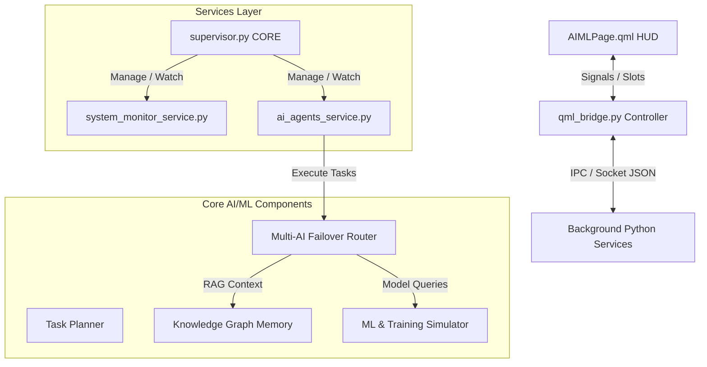
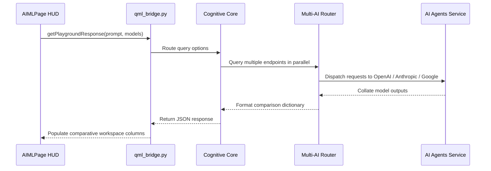

# JARVIS AI & Machine Learning Platform Architecture (v3.0)

This document details the architectural layout, thread model, event routing, and class structures of the integrated AI & ML platform.

---

## 1. Modular System Architecture

JARVIS 3.0 divides its intelligence operations into three distinct layers:
1. **Presentation Layer (QML HUD):** Responsive, GPU-rendered visual panels for active model telemetry, training curve graphics, parallel response playgrounds, and speech/vision control panels.
2. **Bridge Controller (PySide6):** Non-blocking slots and property bindings coordinating visual interactions with background threads.
3. **Execution Engine (Python Background Services):** Dedicated task worker queues, local database graphs, and model failover routers.



---

## 2. Thread Model & Event Flow

To maintain a **60 FPS** GUI rendering target without UI freezing or lag, all intensive workloads are completely decoupled from the main Qt event loop.

```
[ Qt Main GUI Thread ]
       │
       ├─► (Select Model / View Dataset) ─► Slot Call (Instant Cache read) 
       │
[ Background Thread Pool ]
       │
       ├─► Metrics Polling Loop ──► (GPU/Temp: 10s, Battery/Disk: 30s)
       ├─► System Monitor Scan ───► (Scan processes every 3s, write logs/system_monitor.json)
       ├─► Simulated ML Training ──► (Asynchronous Epoch processing, emits logs to trainingHistory)
```

---

## 3. Key APIs & Class Interfaces

### `QMLBridge` (qml_bridge.py)
Exposes the main slots supporting the visual cockpit:
- `switchActiveModel(provider: str, model_name: str) -> None`: Live switches default provider inside settings configuration.
- `getDatasetStats(name: str) -> str`: Performs statistics parsing (rows, cols, missing values, outliers).
- `startMLTraining(framework: str, params_json: str) -> str`: Triggers learning rate sweeps and epoch metrics lists.
- `getPlaygroundResponse(prompt: str, models_json: str) -> str`: Compares parallel queries across Groq, Claude, and Gemini.

### `MultiAgentSystem` (multi_agent_system.py)
Manages the especializados queue worker pools:
- `enqueue_task(task: AgentTask) -> None`: Adds tasks to preferred agent.
- `get_agent_telemetry() -> List[Dict]`: Publishes CPU, RAM, and queue size indicators for the 7 active agents.

---

## 4. Event Flow Pipeline

When a user initiates an interaction (e.g. comparative playground prompts):



---

## 5. Future Extension Points
1. **Native ML Training Hooks:** Swap mock history sweeps in `startMLTraining` for live training tasks invoking local TensorFlow or PyTorch setups on real-time dataset folders.
2. **YOLO Live Webcam Feed:** Bind OpenCV video frame buffers into the Computer Vision QML page to show real-time bounding box annotations on screen.
3. **Local LLM Fine-Tuning:** Integrate PEFT / LoRA wrappers allowing users to upload CSV dataset inputs and fine-tune Ollama base models directly inside the dashboard.
