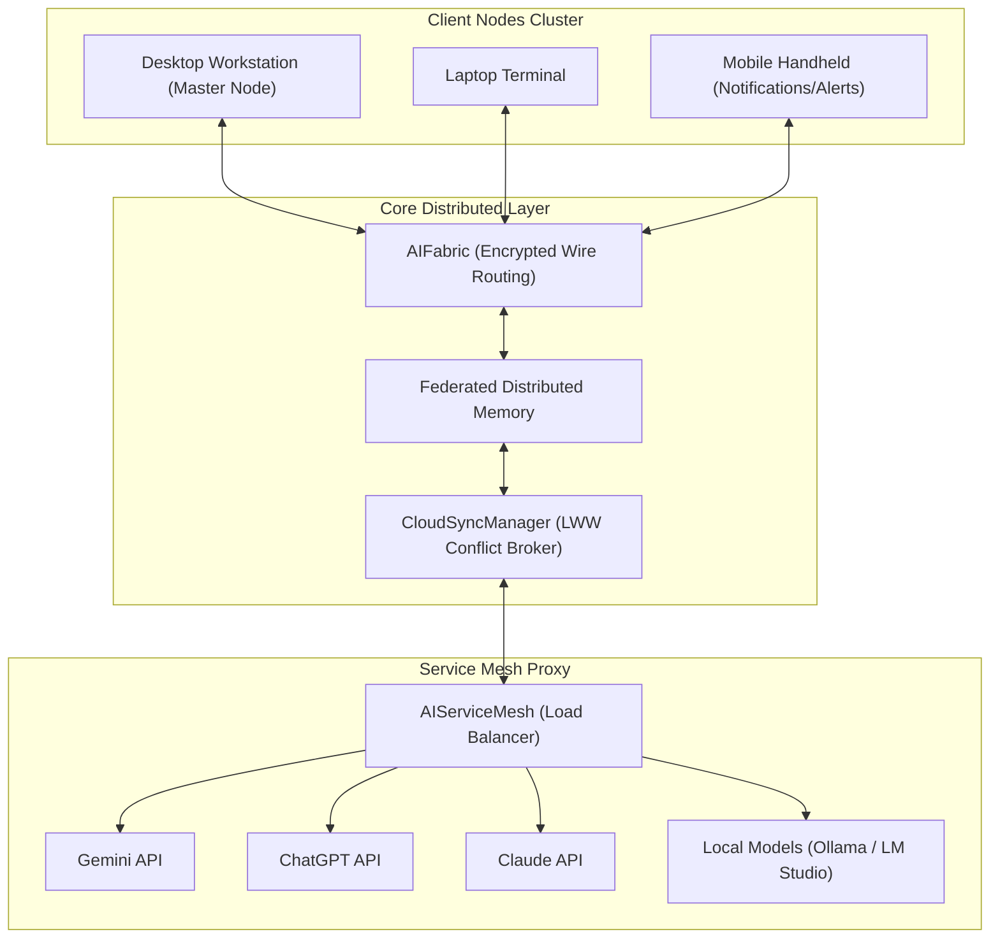
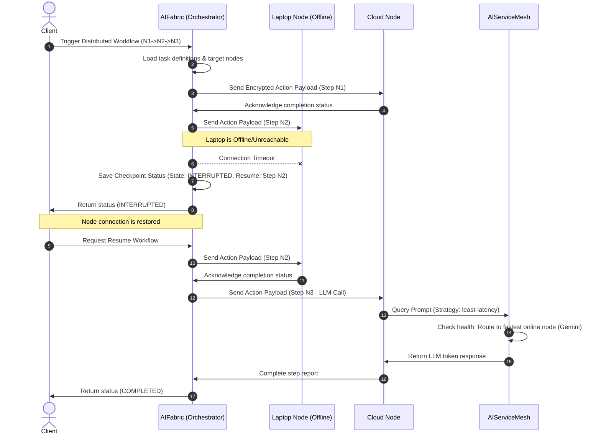

# JARVIS Distributed AI Platform & Cloud fabric Architecture (Phase VI)

This document describes the architectural layout, topology, and execution flows of the JARVIS Distributed AI Platform.

---

## 1. Top-Level Platform Topology

The JARVIS Platform transforms from a local single-device orchestrator into a multi-device distributed intelligence fabric. It syncs settings and states across Desktop, Laptop, Mobile, and Cloud nodes, maintaining offline-first execution capabilities.

---

## 2. Component Design & Responsibilities

### 2.1. Distributed AI Fabric (`ai_fabric.py`)
- **Role**: Wire mesh routing and task execution coordination.
- **Payload Encryption**: All payload transfers are encrypted using symmetric Fernet keys.
- **Workflow Distribution**: Splits workflow steps across virtual nodes, tracking checkpoint states. If a node disconnects, a checkpoint is saved; execution can resume once connection parameters are restored.

### 2.2. Distributed Memory (`distributed_memory.py`)
- **Role**: Memory Federation layer.
- **Federation Scopes**:
  - `session`: RAM cache for short-term telemetry.
  - `working`: immediate instruction cache.
  - `long_term`: personal notes and preferences (Federated).
  - `project`: codebase structure settings (Federated).
  - `cloud`: federated remote synchronization space.
  - `graph`: semantic node bindings (Federated).
  - `vector`: TF-IDF search database.
- **Write-Loop Synchronization**: Federated writes automatically trigger change queues in the synchronization manager.

### 2.3. Offline-First Cloud Sync (`cloud_sync.py`)
- **Role**: LWW (Last-Write-Wins) resolution broker.
- **Offline States**: Buffers actions in a queue during network loss.
- **Conflict Strategy**: Evaluates version counters first, falling back to modification timestamps to ensure correct event ordering.

### 2.4. Service Mesh Proxy (`service_mesh.py`)
- **Role**: Gateway routing client prompt calls through LLM backends.
- **Load Balancing Algorithms**:
  - `least-latency`: Route query to fastest endpoint.
  - `cost-priority`: Route query to lowest-cost endpoint.
  - `round-robin`: Rotates query sequentially.
- **Health diagnostics**: Periodically checks connection status and performs failovers.

### 2.5. Remote API Gateway (`remote_api.py`)
- **Role**: API access portal and monitoring dashboard.
- **Authorization**: OAuth 2.0-compliant Bearer authentication.
- **Web Dashboard**: An HTML5 interface with CSS styling, live state widgets, and a sandbox router playground.
- **Streaming Ports**: Binds Server-Sent Events (SSE) for web dashboards and raw TCP sockets for other network nodes.

---

## 3. Distributed Workflow Execution & Failover Sequence

The diagram below details the sequence of executing steps across multiple machine nodes, handling client timeouts, checkpoint recovery, and backend model load-balancing routing.

