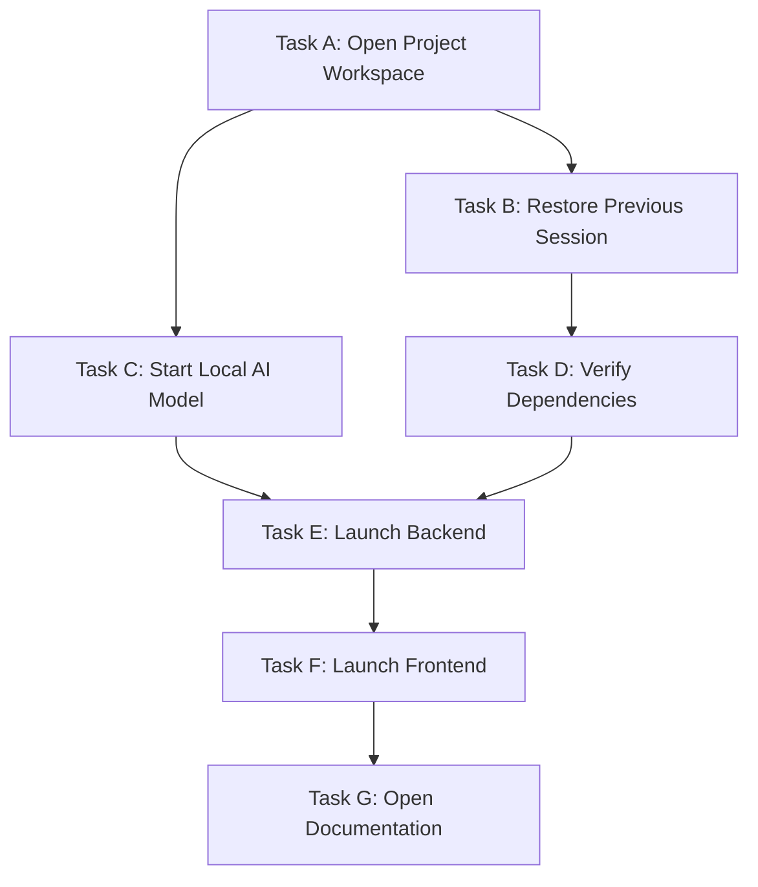
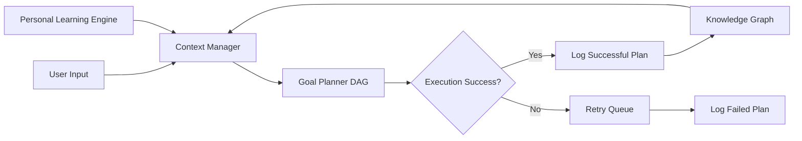

# JARVIS Cognitive Core Phase II Architecture

This document describes the autonomous planning, dynamic model selection, and multi-agent coordination architecture of the JARVIS Cognitive Core (Phase II).

---

## 1. Goal Planner Architecture (DAG Execution)

High-level goals (e.g. "Prepare my AI project") are parsed and decomposed into a Directed Acyclic Graph (DAG) of task nodes. Tasks execute in parallel whenever their listed dependency constraints are satisfied.

### Task Object Definition
Each task node within the DAG contains the following schema:
- `id`: Unique identifier (e.g. `A`, `B`, `C`).
- `agent`: Targeted agent key mapped to capabilities.
- `prompt`: Precise instructions.
- `dependencies`: List of parent task IDs required to complete before running.
- `required_tools`: List of tools required (e.g., `["file_reader"]`).
- `estimated_duration`: Approximate run duration.
- `success_criteria`: Output validation description.
- `rollback_strategy`: Recovery instructions.
- `status`: Lifecycle state (`QUEUED`, `RUNNING`, `COMPLETED`, `FAILED`, `CANCELLED`).

---

## 2. Multi-Agent Coordination Model

Work is dynamically assigned to the 8 core agents by comparing target task capabilities to agent capabilities, rather than static routing paths.

| Agent Key | Description | Capabilities | Preferred Model |
| :--- | :--- | :--- | :--- |
| **coding_agent** | Code construction and linter checks | `["coding", "formatting", "linting", "pytest"]` | Claude 3.5 Sonnet |
| **research_agent** | Information fetches and paper searches | `["research", "literature", "arxiv", "web_search"]` | Gemini 1.5 Pro |
| **ai_and_ml_agent** | Simulated training runs and model indexing | `["train", "dataset", "benchmarks", "sweeps"]` | Gemini 1.5 Pro |
| **cyber_security_agent** | Connection scans and security policy audits | `["security", "port_scan", "log_audit", "cve"]` | ChatGPT 4o |
| **developer_agent** | Build compilers and git deploy loops | `["build", "compile", "refactor", "deploy"]` | Claude 3.5 Sonnet |
| **windows_system_agent** | OS operations and system variables | `["system", "shutdown", "restart", "sleep", "lock", "process"]` | Ollama (Llama 3) |
| **automation_agent** | Keyboard, mouse, and shortcut triggers | `["keyboard", "mouse", "spotify", "play"]` | LM Studio (Mistral) |
| **memory_agent** | User preference mappings and context retrievals | `["memory", "habit", "routine", "learn", "notes"]` | Ollama (Llama 3) |

---

## 3. Dynamic AI Model Selection

The tool router evaluates candidate providers based on:
1. **Latency:** Local models (12-14ms) preferred for low-latency tasks.
2. **Cost:** Local models ($0.0) or DeepSeek preferred for cost-sensitive operations.
3. **Context Length:** Large queries routed to Gemini 1.5 Pro (2M context).
4. **Offline Availability:** Falling back to local Ollama / LM Studio if internet status is `OFFLINE`.

---

## 4. Context Management & Learning Flow

---

## 5. Safety Model & Decision Confidence

Prior to launching any execution task, the Cognitive Core evaluates multi-confidence markers:

$$\text{Overall Confidence} = \frac{\text{Intent Conf} + \text{Planning Conf} + \text{Model Conf} + \text{Execution Conf}}{4}$$

- If **Overall Confidence < 0.90**, or if the action matches the sensitive actions list (e.g. `shutdown`, `delete_file`), execution is paused and a safety confirmation prompt is shown to the user.
- Rollbacks are created automatically before settings changes or critical file modifications.
