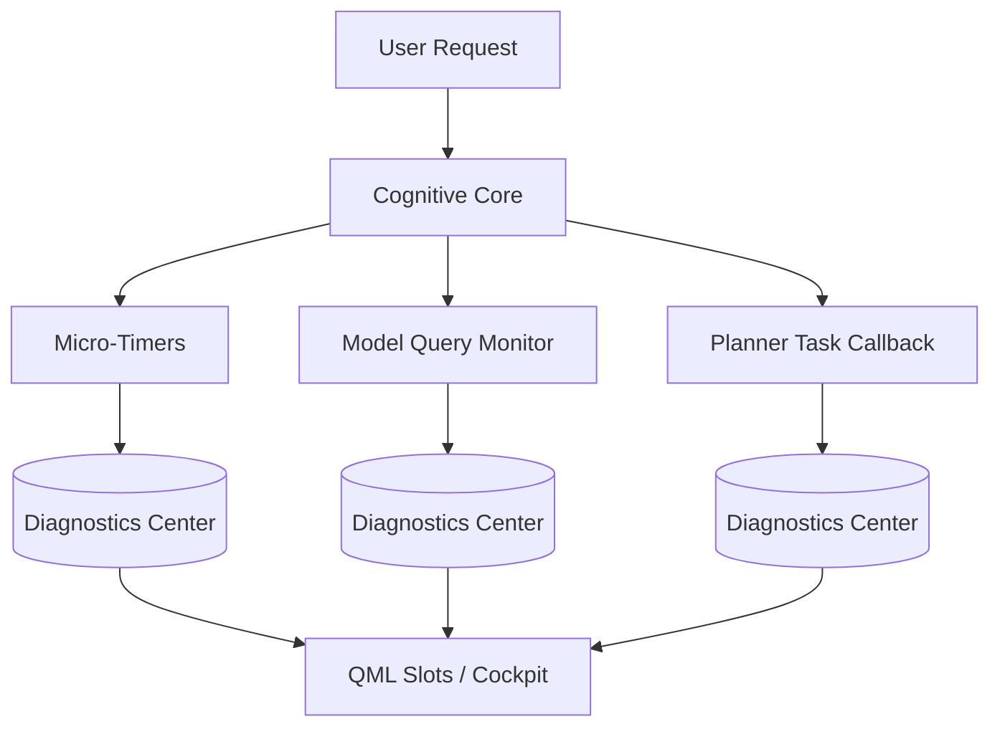

# JARVIS Cognitive Observability Architecture (Phase III)

This document describes the observability, analytics, telemetry collection, and self-improvement architecture of the JARVIS Cognitive Core.

---

## 1. Metrics Architecture

Observability is decoupled from the execution pipeline to eliminate latency impacts. Telemetry is collected asynchronously and persisted locally.

---

## 2. Event Schema

All diagnostic events are logged as structured JSON objects in `logs/diagnostics_history.json` and `logs/runtime_events.jsonl`.

### 2.1. Cognitive Timeline Event Schema
- `intent_detection`: Time spent parsing user intention.
- `context_retrieval`: Time spent fetching Knowledge Graph nodes.
- `memory_lookup`: Time spent searching the Personal Learning Engine.
- `goal_planning`: Time spent decomposing goals into DAG steps.
- `ai_model_selection`: Time spent selecting LLM providers.
- `tool_selection`: Time spent mapping tasks to agent queues.
- `safety_evaluation`: Time spent verifying safety policies.
- `execution`: Time spent running LLM inference / local CLI tools.
- `learning`: Time spent updating reinforcement learning files.
- `memory_update`: Time spent updating Knowledge Graph nodes.

### 2.2. Model Query Event Schema
- `provider`: Target LLM provider (Google, Anthropic, OpenAI, xAI, DeepSeek, Local).
- `latency_ms`: Response time.
- `cost`: Total cost computed from estimated input/output tokens.
- `tokens`: Number of tokens processed.
- `success`: Query outcome boolean.

---

## 3. Analytics Pipeline

1. **Extraction:** Telemetry is emitted from every pipeline stage in `cognitive_core.py` and `multi_agent_system.py`.
2. **Aggregation:** The singleton `DiagnosticsCenter` class aggregates events (computes running averages, failure rates, utilization rates, and DAG depths).
3. **Storage:** Diagnostics are serialized locally to `logs/diagnostics_history.json`.
4. **Presentation:** Registered Qt Slots in `qml_bridge.py` retrieve aggregated analytics as JSON strings to feed QML dashboard elements.

---

## 4. Self-Improvement Engine Recommendations

Heuristic analyzers continuously parse execution history and compile recommendations:
- **Model routing overrides:** Suggests shifting specific tasks to alternate models when latency or cost deviations are detected.
- **Planner optimizations:** Suggests restructuring task dependencies to run sequentially linked tasks in parallel.
- **Cache adjustments:** Recommends clearing stale knowledge graphs or log entries when startup parsing latency exceeds limits.
