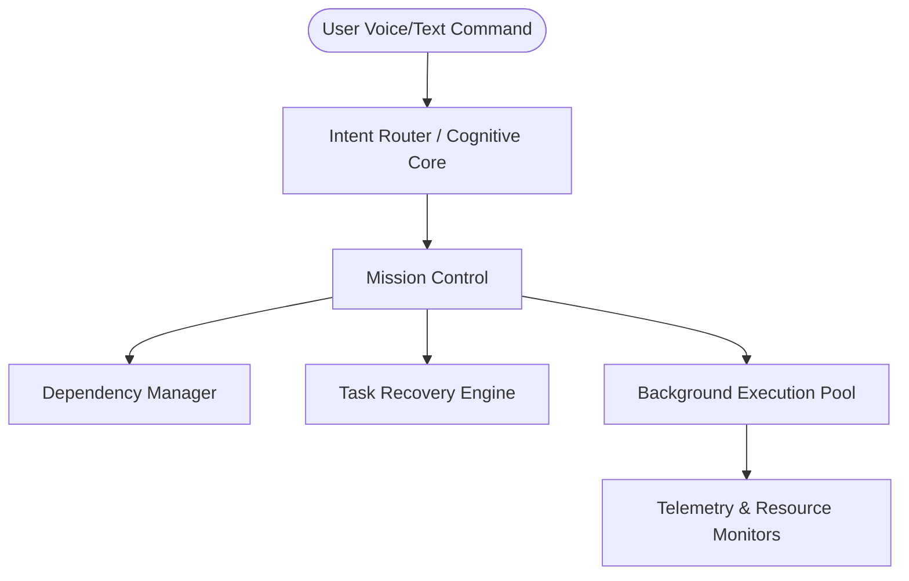

# JARVIS Mission Control Architecture Spec

This document details the multi-tasking scheduling, topological sorting, and background execution architecture of the JARVIS AI Operating System.

---

## 1. System Overview

## 2. Component Layout

- **Mission Control Engine**: coordinates task prioritization, queues, and status transitions.
- **Dependency Manager**: checks for cycle loops and identifies blocking paths.
- **Task Recovery Engine**: parses logs of failed tasks, triggers pip installs or connection refreshes, and auto-retries execution.
- **Observability System**: dumps telemetry metrics (`execution_time`, `failures`, `retries`, `cpu`, `ram`) to `logs/mission_control_state.json`.
