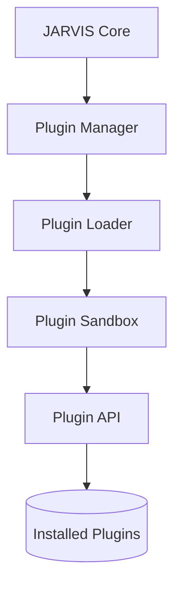

# JARVIS Plugin Ecosystem Architecture

This document describes the design, sandbox limits, dynamic loader, and marketplace validation of the JARVIS Enterprise Plugin Ecosystem.

---

## 1. Core Architecture

The Plugin Ecosystem enables modular third-party integrations to expand operating system, developer, and AI capabilities without code alterations:

---

## 2. Manifest Specification

Every plugin includes a `manifest.json` schema declaring its details:
- `name`: Unique name identifier.
- `version`: Version identifier (e.g. `1.0.0`).
- `author`: Developer details.
- `plugin_entry`: Python entry script filename (typically `plugin.py`).
- `class_name`: Entry tool class name inheriting from `ToolBase`.
- `permissions`: Required permissions array (e.g., `["filesystem", "network"]`).
- `dependencies`: List of python pip dependencies required.

---

## 3. Plugin Sandbox & Exception Containment

To ensure system stability, plugins run inside the `PluginSandbox`:
- **Crash Containment:** Execution is wrapped in a thread-safe `try-except` block, preventing a malfunctioning plugin from crashing the main JARVIS thread.
- **Timeouts:** Plugin execution is capped at a maximum of 3.0 seconds, returning a timeout fault if blocked.
- **Permissions Gate:** The `PluginLoader` checks requested permissions against the global granted scope prior to importing the entry module.
