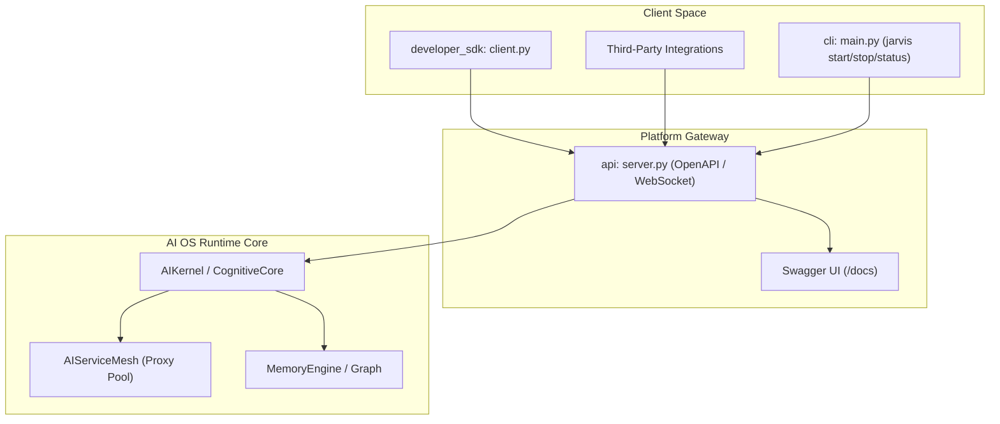
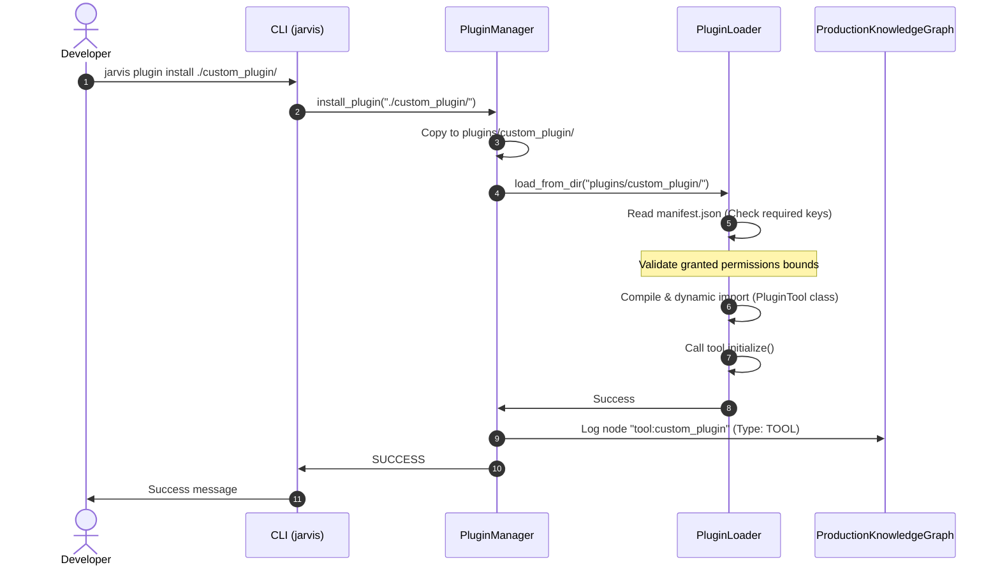

# JARVIS Enterprise Developer Platform & SDK Architecture (Phase VII)

This document describes the design, layout, integration, and capabilities of the JARVIS extensibility framework.

---

## 1. Platform Extensibility Topology

The Developer Platform wraps the underlying JARVIS AI Operating System core with a suite of client SDK interfaces, CLI administration commands, and secure REST/WebSocket network gateways.

---

## 2. Component Design & Directory Structures

### 2.1. Developer Client SDK (`developer_sdk/`)
- **`client.py`**: Exports `JarvisClient` exposing namespaces:
  - `ai`: wraps prompts routing.
  - `memory`: writes to Session, Working, Long-Term, or Project layers.
  - `graph`: node registrations and connected relationship checks.
  - `workflow`: triggers DAG execution threads.
  - `plugins`: telemetry usage checks.
- **`templates.py`**: Scaffolds boilerplates (Custom Tools subclassing `ToolBase`, Workflow configs, Agent schemas).
- **`examples.py`**: Sample script showing standard client interaction patterns.

### 2.2. Command Line Interface (`cli/`)
- **`main.py`**: Controls start/stop states and diagnostic metrics from the terminal:
  - `jarvis start` / `stop` / `restart`: manages background HTTP process server (mapping to `logs/jarvis_server.pid`).
  - `jarvis status`: audits active processes and node clusters.
  - `jarvis plugin install <dir>` / `remove <name>`: calls `PluginManager` installation routines.
  - `jarvis workflow run <json_path>`: executes DAG runs.
  - `jarvis ai benchmark`: triggers performance latency metrics comparisons.
  - `jarvis diagnostics`: checks CPU RSS allocations and thread daemon listings.
  - `jarvis backup` / `restore`: packages persistent database JSON files into ZIP archives.

### 2.3. REST & WebSocket Gateways (`api/`)
- **`server.py`**: Implements a threaded HTTP server exposing secure REST paths:
  - `/api/v1/ai` (routes prompt payload)
  - `/api/v1/graph` (node lists)
  - `/api/v1/plugins` (registry lists)
  - `/api/v1/diagnostics` (hardware metrics)
  - `/openapi.json` & `/docs` (served interactive Swagger UI interface via CDN)
  - `/api/v1/stream` (SSE Event Stream: broadcasts live logs of actions, memory writes, and workflow executions)
- Security bounds: checks Bearer OAuth credentials and blocks IPs exceeding 60 requests/minute.

### 2.4. Setup Pre-Flight Wizard (`installer/`)
- **`setup_wizard.py`**: Runs pre-flight audit evaluations (requires Python >= 3.9, checks disk space, reads requirements). Prompts setup variables and snaps databases before executing rolling upgrades (rollback restores if fail triggers).

### 2.5. Release Packaging Pipeline (`release_pipeline/`)
- **`builder.py`**: Runs verification test sweeps, packages files excluding local directories (such as `.venv`, `dist`, `.pytest_cache`), and generates markdown release notes.

---

## 3. Extension Scaffolding & Dynamic Plugin Verification Flow

The sequence below illustrates a developer installing a custom tool plugin, auditing its manifest validation schemas, executing its sandbox checks, and validating DAG dependencies before releasing the code bundle.

