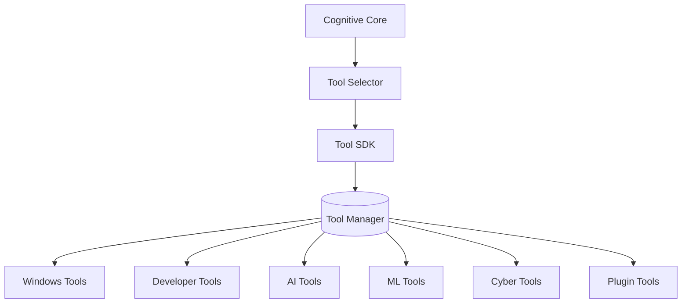

# JARVIS Tool SDK Architecture

This document describes the design, permissions model, execution safety, and extensibility of the JARVIS Tool SDK.

---

## 1. Core Architecture

The Tool SDK operates as the single unified execution layer coordinating all system and network capabilities:



---

## 2. Standard Interface Specifications

### 2.1. Tool Base Class
Every capability inherits from the common `ToolBase` abstract class:
- `execute(**kwargs)`: Runs the capability, returning a `ToolResult`.
- `validate(**kwargs)`: Syntactically verifies input arguments.
- `rollback()`: Reverts any changes if a pipeline execution fails.
- `health()`: Telemetry health checks.
- `permissions()`: Declares required OS scopes (`filesystem`, `network`, etc.).
- `metrics()`: Performance telemetry reporting.
- `initialize()` / `shutdown()`: Startup verification and handle releases.

### 2.2. ToolResult
Every tool returns a standardized wrapper containing:
- `success`: Execution outcome boolean.
- `output`: Arbitrary data map.
- `error`: Diagnostic details on failure.
- `elapsed_ms`: Profiled execution latency.

---

## 3. Dynamic Execution & Safety Model

Execution follows a strict safety validation cycle:

```
Plan -> Validate Args -> Permission Check -> Execute -> Verify Success -> Rollback (if needed) -> Log Telemetry
```

If any step fails, the Tool Manager automatically triggers the tool's `rollback()` hook before returning the failure log to the user.

---

## 4. Plugin SDK Manifest Format

Third-party capabilities can be loaded dynamically by dropping the plugin module in the `plugins/` directory:

```json
{
  "name": "Custom File Parser",
  "version": "1.0.0",
  "author": "JARVIS Team",
  "description": "Reads and analyzes raw system audit logs.",
  "plugin_entry": "plugin.py",
  "class_name": "PluginTool",
  "permissions": ["filesystem"],
  "dependencies": ["psutil"]
}
```
Plugins are discovered and initialized at runtime by the `ToolManager.load_plugin()` loader.
