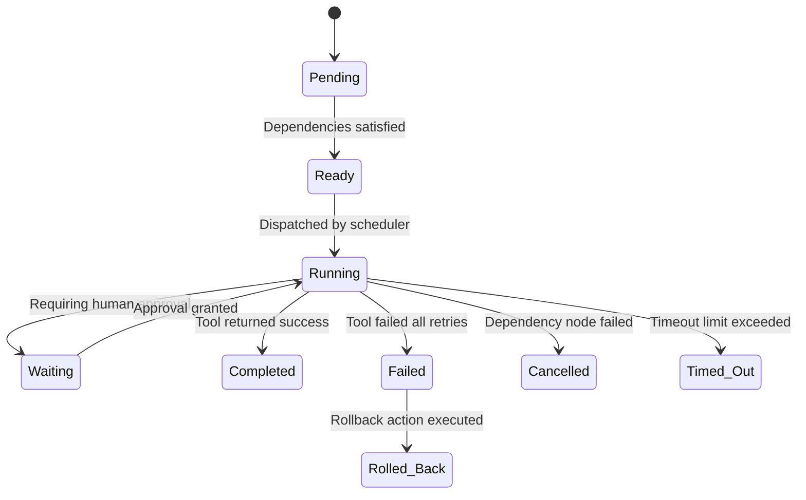

# JARVIS Workflow Engine Architecture

This document describes the workflow modeling, task scheduling, conditional execution, and rollback strategies of the JARVIS Workflow Automation Engine.

---

## 1. Workflow Life Cycle (State Machine)

Every workflow node transitions through the following lifecycle states:

---

## 2. Dependency Resolution (DAG Scheduler)

1. The scheduler scans all `Pending` nodes.
2. If a node lists zero dependencies, or all listed parent node IDs are marked `Completed`, it is set to `Ready`.
3. The scheduler triggers the tool execution in a dedicated background thread, ensuring multiple branches of the DAG run concurrently.
4. If any node fails and is unrecoverable, downstream dependent nodes are marked `Cancelled`, and topological rollback is triggered.

---

## 3. Reusable Workflow Library

| Workflow Template | Decomposed Tasks (DAG) | Main Agents |
| :--- | :--- | :--- |
| **Development Startup** | IDE setup $\rightarrow$ Restore $\rightarrow$ Start Local LLM $\rightarrow$ Build Backend $\rightarrow$ Launch Frontend $\rightarrow$ Launch Docs | `windows_system_agent`, `developer_agent`, `research_agent` |
| **Daily System Health** | Check hardware load $\rightarrow$ Audit event logs $\rightarrow$ Write summary report | `windows_system_agent`, `cyber_security_agent` |
| **Research Session** | Fetch documents notes $\rightarrow$ Query Knowledge Graph $\rightarrow$ Open web sources $\rightarrow$ Summarize | `memory_agent`, `research_agent` |
