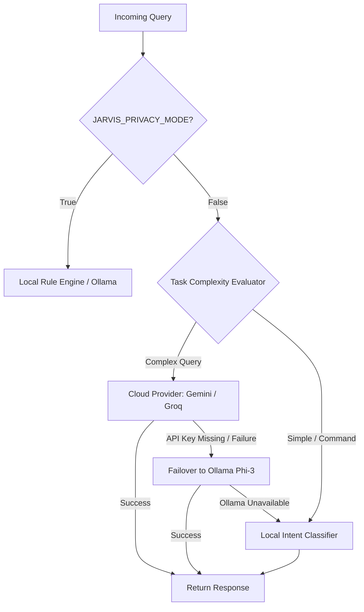

# 🧠 Hybrid AI Router & Orchestrator

The Hybrid AI Router intelligently balances speed, accuracy, cost, and offline privacy by dynamically cascading queries across available AI providers.

---

## 🔀 Cascading Failover Topology

---

## 🤖 Supported AI Providers

| Provider | Type | Latency | Key Requirements | Primary Use Case |
|---|---|---|---|---|
| **Google Gemini** | Cloud API | ~400ms | `GEMINI_API_KEY` | General reasoning, complex queries, multi-modal analysis |
| **Groq Cloud** | Cloud API | ~150ms | `GROQ_API_KEY` | Ultra-fast text generation, sub-second responses |
| **Local Ollama** | Local LLM | ~1.5s (CPU/GPU) | Ollama running locally (`phi3:latest`) | Offline operation, full data privacy |
| **Offline Rules** | Deterministic | <1ms | None | System commands, media control, math calculations |

---

## ⚡ Fallback Logic

1. **Attempt 1**: Route to highest priority configured provider (`GEMINI_API_KEY` or `GROQ_API_KEY`).
2. **Attempt 2**: If Cloud API fails or key is missing, cascade to local Ollama server (`http://127.0.0.1:11434`).
3. **Attempt 3**: If Ollama is not installed/running, fallback to local rule-based intent router (`JARVIS/core/automation/local_intent_router.py`).
