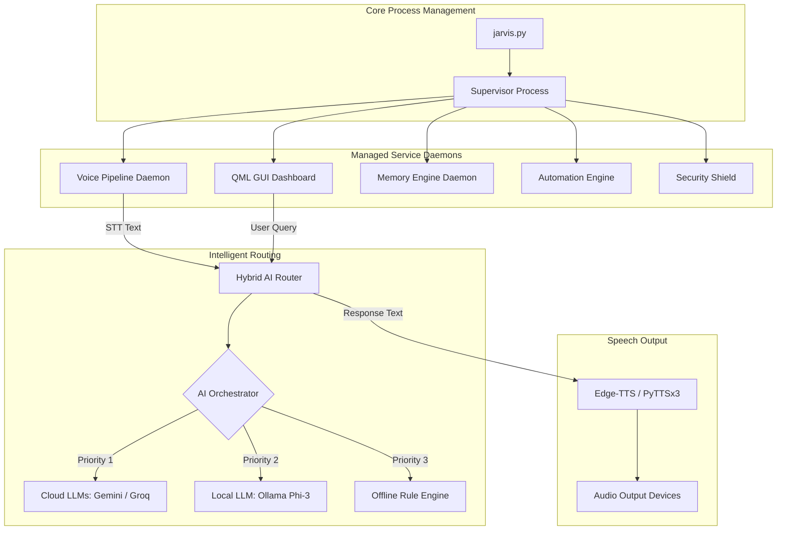

# 🏛️ HESA Architecture & Design Specification

HESA (JARVIS) is designed as a multi-process, decoupled, event-driven desktop AI operating system.

---

## 📐 High-Level Topology

---

## 🧩 Subsystem Specifications

### 1. Main Controller (`jarvis.py`)
- **Single-Instance Enforcement**: Windows Win32 Named Mutex (`Local\JARVIS_GUI_SINGLETON_MUTEX_v2`).
- **Environment Validation**: Verifies Python version, dependency integrity, and `.env` presence.
- **Process Orchestration**: Spawns and attaches to the Supervisor daemon.

### 2. Supervisor Service (`JARVIS/services/supervisor.py`)
- Monitors active child processes by PID.
- Detects memory leak growth rates (>50 MB/min) and triggers auto-restarts.
- Automatically handles safe-mode failover if a critical service crashes 3 times sequentially.

### 3. Voice Pipeline (`JARVIS/core/voice/`)
- **Wake Word**: OpenWakeWord engine with custom ONNX model (`hey_jarvis`), running at ~10ms frame intervals.
- **VAD**: Silero VAD for active speech detection.
- **STT**: Faster-Whisper offline transcription engine.
- **TTS**: Edge-TTS (online natural voice) falling back to pyttsx3 (offline SAPI5).

### 4. Hybrid AI Router (`JARVIS/core/ai_router/`)
- Evaluates incoming prompt complexity.
- Routes queries through an adaptive cascade: Cloud API $\rightarrow$ Local Ollama $\rightarrow$ Deterministic local rules.

### 5. Memory Engine (`memory_engine.py`)
- **Tier 1 (Working)**: Fast JSON key-value working memory.
- **Tier 2 (Long-term)**: SQLite 3 database for persistent notes and settings.
- **Tier 3 (Semantic)**: Vector & Knowledge Graph semantic search index.

### 6. Security Shield (`JARVIS/core/security/`)
- Fernet AES-128 key encryption for saved credentials.
- Path traversal and dangerous command safety check layer.
- Sandboxed plugin runtime environment.
