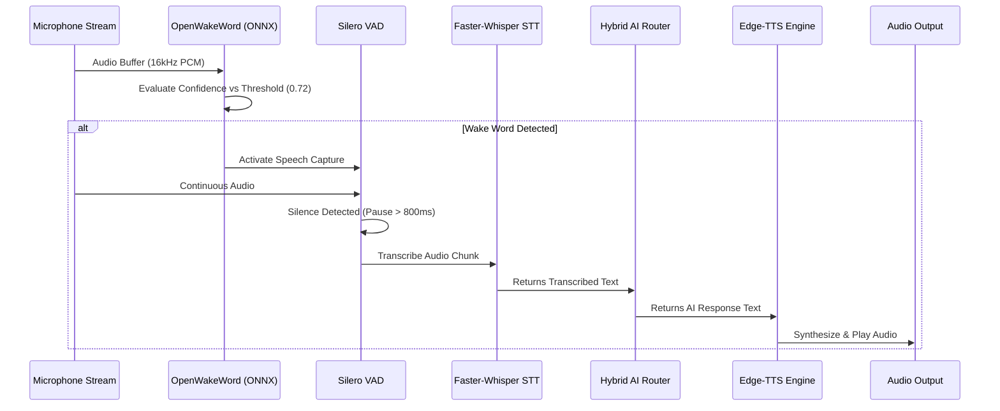

# 🎙️ HESA Voice Pipeline Architecture

The HESA Voice Pipeline delivers zero-latency wake word detection, accurate offline speech-to-text, and natural voice speech synthesis.

---

## 🔄 Voice Processing Sequence



---

## ⚙️ Core Pipeline Components

### 1. Wake Word Engine (`openwakeword_engine.py`)
- Uses ONNX Runtime for ultra-low latency CPU execution (~5ms per frame).
- Default Model: `hey_jarvis.onnx`
- Default Sensitivity Threshold: `0.72`

### 2. Speech-to-Text (STT) (`faster_whisper_engine.py`)
- Engine: Faster-Whisper (CTranslate2 optimized Whisper model).
- Models supported: `tiny.en`, `base.en`, `small.en`.
- Fallback: Offline Google Speech Recognition fallback when model isn't downloaded.

### 3. Text-to-Speech (TTS) (`ses_motoru.py` & `speech_backend.py`)
- Primary: Edge-TTS (Neural cloud voices like `en-US-ChristopherNeural` or `en-US-AriaNeural`).
- Fallback: Local SAPI5 pyttsx3 engine when network is offline.

---

## 🛠️ Configuration Options

In `.env`:
```env
JARVIS_WAKE_WORD=hey_jarvis
JARVIS_WAKE_THRESHOLD=0.72
JARVIS_STT_ENGINE=faster_whisper
JARVIS_TTS_PROVIDER=edge
```
