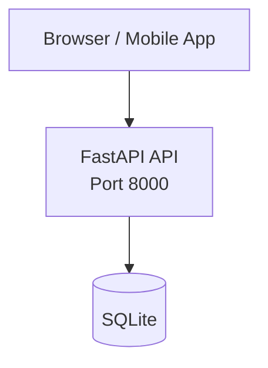

# Task Manager — Architecture

## System Overview



## Technology Decisions

| Component | Technology | Rationale |
|-----------|-----------|-----------|
| Backend | FastAPI | High performance async, auto OpenAPI docs, Pydantic validation |
| Frontend | N/A | Matches project requirements |
| Database | SQLite | Zero-config, file-based, perfect for development |
| Auth | None | No authentication required for this service |

## Data Models

### Item

```
Item
    + Integer id
    + String(200) title
    + Text description
    + Boolean is_completed
    + Integer owner_id
    + DateTime created_at
    + DateTime updated_at
```


## API Endpoints

| Method | Path | Description | Auth Required |
|--------|------|-------------|---------------|
| `GET` | `/api/items` | List all items | ✅ |
| `POST` | `/api/items` | Create new item | ✅ |
| `GET` | `/api/items/{id}` | Get item by ID | ✅ |
| `PUT` | `/api/items/{id}` | Update item | ✅ |
| `DELETE` | `/api/items/{id}` | Delete item | ✅ |

---

*Generated by JARVIS Architecture Documentation Agent*
